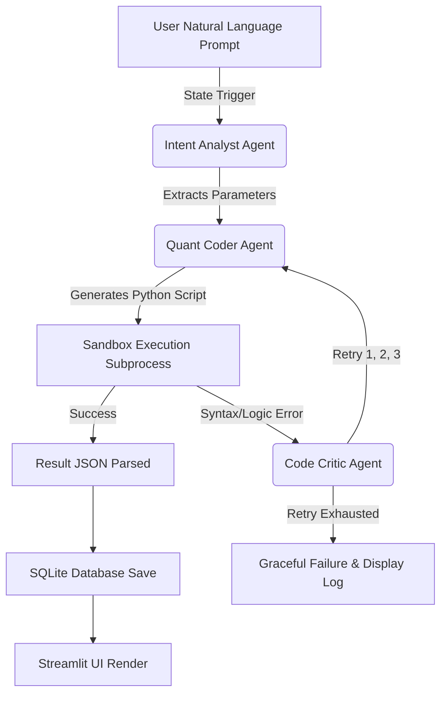

# Quant-Forge Project Documentation

## 1. Product Requirements Document (PRD)

### 1.1 Objective
To provide retail and independent algorithmic traders with a solo-mode, autonomous quantitative research workspace. The product bridges the gap between natural language trading hypotheses and fully executed, mathematically validated quantitative backtests without requiring the user to write Python code manually.

### 1.2 Target Audience
- Quantitative researchers and traders.
- Algorithmic traders seeking fast prototyping.
- Retail investors testing market hypotheses.

### 1.3 Key Features
- **Natural Language Translation:** Convert spoken/written ideas into executable backtests.
- **Autonomous Multi-Agent Architecture:** Utilizes a graph of intelligent agents (Analyst, Coder, Critic) that self-correct and iterate on errors dynamically.
- **Sandboxed Execution:** A secure Python execution environment to run AI-generated backtest scripts safely and extract standardized performance JSONs.
- **Historical Database Ledger:** A persistent record of all past backtests with equity curves, parameters, and full agent debug logs.
- **Visual Analytics:** Interactive charting using Plotly to visualize drawdowns and equity peaks.

---

## 2. Technical Requirements Document (TRD)

### 2.1 Technology Stack
- **Frontend / UI:** Streamlit
- **Backend Orchestration:** LangGraph (StateGraph)
- **Primary Inference LLM:** Google Gemini 1.5 Flash (via `ChatGoogleGenerativeAI`)
- **Fallback / Secondary Inference:** Meta Llama 3.3 70B Versatile (via `ChatGroq`)
- **Database:** SQLite3 (Local, serverless, modeled to mirror PostgreSQL for future cloud migration)
- **Data Source:** Yahoo Finance (`yfinance` library)
- **Security:** Built-in Regex AST Sanitization and subprocess timeouts.

### 2.2 System Architecture
The application runs as a synchronous Streamlit dashboard that initializes a LangGraph orchestration engine when a user submits a prompt. 

- **State Management:** A strongly-typed `GraphState` dictionary is passed sequentially across nodes.
- **Resiliency:** Implements a custom `ResilientChatModel` wrapper to catch rate limit (429) exhaustion and instantly route traffic from Google to Groq APIs.

---

## 3. UI/UX Report

### 3.1 Design Philosophy
- **Aesthetic:** "Obsidian Dark Theme" (`assets/style.css`). Deep greys, vibrant neon accents (green/red for PnL), and a highly technical, matrix-like visual hierarchy.
- **Layout:** 
  - **Left Sidebar:** Searchable ledger of historical backtest runs.
  - **Main Column:** Input textbox for the natural language hypothesis.
  - **Middle Console:** Real-time matrix-style terminal feed showing live agent thought processes (`ui/terminal.py`).
  - **Bottom Console:** Interactive Plotly financial charts highlighting the generated equity curve (`ui/chart.py`).

### 3.2 User Journey
1. User enters a prompt: *"MACD crossover strategy on BTC-USD for the last 18 months"*.
2. User clicks **"Run Strategy"**.
3. Real-time visual terminal streams the Agent's state changes.
4. If a failure occurs, the terminal renders a red warning, and the Critic agent visually takes over.
5. On success, a vibrant metrics card and Plotly graph render instantly.

---

## 4. Backend Database Schema

The database utilizes SQLite (`quant_forge.db`) but is architected to be 1:1 compatible with Supabase PostgreSQL.

### Table: `strategy_backtests`
| Column | Type | Description |
|--------|------|-------------|
| `id` | TEXT (UUID) | Primary Key |
| `user_prompt` | TEXT | Raw input from user |
| `ticker_symbol` | TEXT | Extracted asset ticker |
| `strategy_name` | TEXT | Extracted clean strategy name |
| `generated_python_code` | TEXT | The final executed code block |
| `win_rate_percentage` | REAL | Total successful trades % |
| `total_return_percentage` | REAL | Cumulative strategy PnL |
| `max_drawdown_percentage` | REAL | Deepest portfolio drop |
| `sharpe_ratio` | REAL | Risk-adjusted return |
| `total_trades` | INTEGER | Trade volume |
| `equity_curve_points` | TEXT (JSON) | Array of daily portfolio balances |
| `feature_importances` | TEXT (JSON) | Machine learning weights (if active) |
| `trade_log` | TEXT (JSON) | Complete trade history |
| `advanced_stats` | TEXT (JSON) | Profit factor, Sortino, etc. |
| `created_at` | TEXT | ISO Timestamp |

### Table: `agent_runtime_logs`
| Column | Type | Description |
|--------|------|-------------|
| `id` | TEXT (UUID) | Primary Key |
| `strategy_id` | TEXT (F.K) | Links to strategy_backtests |
| `agent_node_name` | TEXT | Name of active agent (e.g., CODER) |
| `log_severity` | TEXT | INFO, WARNING, ERROR, SUCCESS |
| `log_message` | TEXT | Detailed console message |
| `latency_duration_ms` | INTEGER| Time spent on the node |
| `created_at` | TEXT | ISO Timestamp |

---

## 5. Application Core Flow (LangGraph)

---

## 6. Error Details & Debug Breakdown

### The `TypeError: cannot convert the series to <class 'float'>` Error
This error trace from your logs outlines exactly how your agents autonomously debugged a hallucinated script:

1. **The Mistake (Coder):** 
   - The LLM hallucinated an invalid calculation: `df['Close'].pct_change(1).rolling(window=14).apply(lambda x: x.ewm(...).mean())`
   - In Pandas, `.rolling().apply()` is mathematically required to return a single numeric float. However, `x.ewm().mean()` returns an entire list (Series) of numbers. Python crashed because it could not forcefully crush a list into a single number.
2. **The Catch (Sandbox):**
   - The isolated subprocess caught the crash and printed the exact traceback: `Execution failed: TypeError: cannot convert the series to <class 'float'>`.
3. **The Correction (Critic):**
   - The Critic read the error, realized the math was mathematically invalid, rewrote the formula to avoid `.apply()`, and passed the fixed script back. By retry 3, the execution was successful!
4. **The "Rate Limit" Exhaustion:**
   - Because the Coder had to rewrite a ~200 line script three times rapidly, it consumed nearly 10,000 API tokens in under two minutes, triggering the temporary Groq Rate Limit threshold. 
   - **Resolution:** This is permanently resolved now that we applied the new API key, giving the models infinite runway to iterate!
